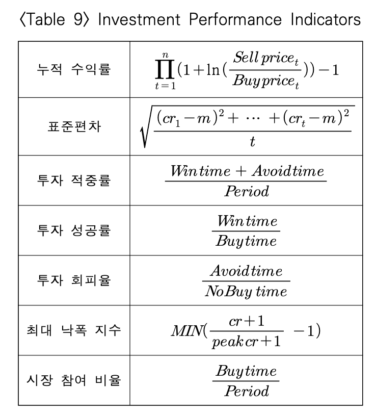
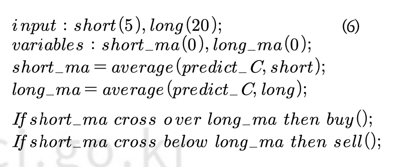
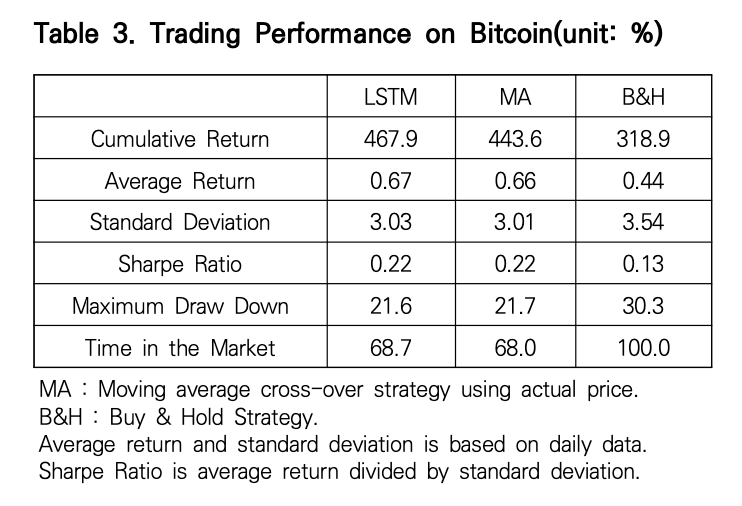

# 2024coin

## project layout

1. research & make strategies

   - 상승장(2023/04 - 2024/03), 하락장(2021/12 - 2022/11), 횡보장(2022/07 - 2023/06) 구분 + 합쳐서 해야할듯
   - 21/04 - now도 괜찮을수도 -> 첫번째 고점 이후

2. validate strategies (backtest)
3. make it work
4. make a outfit (program or just local page)

## 기존 연구 분석

### 1. 딥러닝과 단기매매전략을 결합한 암호화폐 투자 방법론 실증 연구 - 이유민, 이민혁

#### 1.1 참고 문헌

이은우, 이원부, 2022
변동성돌파전략 적용 시 매수가 일어난 날들을 학습 -> LSTM

#### 1.2 연구 설계 부분

하락 추세였던 2022년 1월 ~ 5월 자료를 사용했음.
과거 7일의 데이터로 다음 날 종가를 예측.

#### 1.3 데이터

- 날짜
- 시가
- 고가
- 저가
- 종가
- 거래량

#### 1.4 LSTM 파라미터

##### Model3

1. learning rate = 0.002
2. 1st layer unit = 64
3. 2nd layer unit = 4
4. epoch = 200
5. batch size = 64
6. loss function = MSE

7. window size = 7
8. 활성화 함수(activation function) = 하이퍼볼릭 탄젠트(hyperbolic tangent)
9. 옵티마이저(optimizer) = Adam (오차 감소 속도가 빠름(?))

#### 1.5 best model 매매 규칙

당일 고점과 당일 예측 종가가 당일 타겟가보다 높을 때, 당일 타겟가에 구매해서 당일 종가에 판매.

```python
if high(t) > target(t) & pred(t) > close(t):
 buy(price=target(t))
```

#### 1.6 연구 결과 성과 분석을 위한 성과 지표



#### 1.? 궁금증

- 종가 기준은 몇시?
  1. 아마 pyupbit에서 일별 데이터 그대로 가져다 쓴 것 같은데 이런 경우에는 오전 9시로 설정됨
- 슬리피지 고려 했나?
- combo1-C 가 시장참여비율이 낮아서 수익률이 높을 수도. 하락장에 시자아 참여 비율이 낮다는 것은 긍정적이지만, 상승장에서 따라갈 수 있는지도 확인해야.

### 2. 딥러닝을 이용한 비트코인 투자전략의 성과 분석 - 김선웅 2021

#### 2.1 참고문헌

L. Liu. (2019). Are Bitcoin returns predictable? Evidence from technical indicators. Physica A, 533, 1-6.
DOI : 10.1016/j.physa.2019.121950
-> momentum, filter rule, 이동평균선, rsi, 지지 - 저항선 결합 투자 전략이 개별 기술 지표보다 우수했음.

#### 2.2 데이터 소개

2017년 5월 23일 ~ 2021년 1월 23일

#### 2.3 연구 방법

1. 비트코인 일별 시가, 고가, 저가, 종가, 일별 수익률 자료 활용 다음 날 비트코인 종가 예측
2. LSTM 비교 모형으로 단순 RNN
3. 최적화 알고리즘 adam optimizer 이용 -> 오차 감소 속도
4. 활성화 함수 -> hyperbolic tangent
5. 지도학습(epoch) 100번. 추가적으로 확대해도 크게 성과 차이 x


#### 2.4 비교 투자 전략

1. 이동평균선 교차 전략 + lstm

   - 단기 이평선(5)이 장기 이평선(20)을 상향 돌파할 경우 돌파 시점 종가로 매수. 반대의 경우 돌파 시점 종가로 매수 포지션 청산
     

2. 그냥 이동평균선 교차 전략

   - 1 but no predict C just C

3. buy & hold

#### 2.5 전략 별 성과



그냥 ma 전략이랑 차이가 이 정도면 그냥 예측 안해도 되는거 아님?

<!--  -->

### 3. 기술적 지표 + 다이버전스 + 프라이스액션?

#### 3.1 분석할만한 지표?

- rsi macd momentum ma ...
- hash rate?
- kimchi premium
- 변동성 돌파 전략

### 4. 감성분석

- 키워드 검색량
- 감성분석

## make strategies

1. 기술적 지표 전략들

   1. rsi
   2. macd
   3. ma
   4. momentum
   5. hash rate
   6. 변동성 돌파
   7. 키워드 검색량

2. 머신러닝 전략들

   1. linear regression
      기술적 지표 전략
   2. LSTM

3. 감성분석 전략

   1. 키워드 검색량
   2. 감성분석

4. 혼합 전략

## ideas

- 하루의 기준 -> 평균 거래량이 가장 적은 시간대가 적당하지 않을까?
