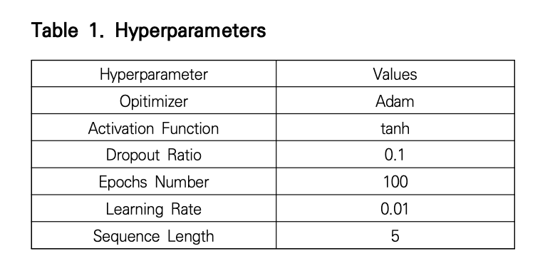

# 2024coin

## project layout

1. research & make strategies

   - 상승장(2023/04 - 2024/03), 하락장(2021/12 - 2022/11), 횡보장(2022/07 - 2023/06) 구분 + 합쳐서 해야할듯
   - 21/04 - now도 괜찮을수도 -> 첫번째 고점 이후

2. validate strategies (backtest)
3. make it work
4. make a outfit (program or just local page)

## 기존 연구 분석

### 1. 딥러닝과 단기매매전략을 결합한 암호화폐 투자 방법론 실증 연구 - 이유민, 이민혁

#### 1.1 참고 문헌

이은우, 이원부, 2022
변동성돌파전략 적용 시 매수가 일어난 날들을 학습 -> LSTM

#### 1.2 연구 설계 부분

하락 추세였던 2022년 1월 ~ 5월 자료를 사용했음.
과거 7일의 데이터로 다음 날 종가를 예측.

#### 1.3 데이터

- 날짜
- 시가
- 고가
- 저가
- 종가
- 거래량

#### 1.4 LSTM 파라미터

##### Model3

1. learning rate = 0.002
2. 1st layer unit = 64
3. 2nd layer unit = 4
4. epoch = 200
5. batch size = 64
6. loss function = MSE

7. window size = 7
8. 활성화 함수(activation function) = 하이퍼볼릭 탄젠트(hyperbolic tangent)
9. 옵티마이저(optimizer) = Adam (오차 감소 속도가 빠름(?))

#### 1.5 best model 매매 규칙

당일 고점과 당일 예측 종가가 당일 타겟가보다 높을 때, 당일 타겟가에 구매해서 당일 종가에 판매.

```python
if high(t) > target(t) & pred(t) > close(t):
 buy(price=target(t))
```

#### 1.6 연구 결과 성과 분석을 위한 성과 지표


#### 1.? 궁금증

- 종가 기준은 몇시?
  1. 아마 pyupbit에서 일별 데이터 그대로 가져다 쓴 것 같은데 이런 경우에는 오전 9시로 설정됨
- 슬리피지 고려 했나?
- combo1-C 가 시장참여비율이 낮아서 수익률이 높을 수도. 하락장에 시자아 참여 비율이 낮다는 것은 긍정적이지만, 상승장에서 따라갈 수 있는지도 확인해야.

### 2. 딥러닝을 이용한 비트코인 투자전략의 성과 분석 - 김선웅 2021

#### 2.1 참고문헌

L. Liu. (2019). Are Bitcoin returns predictable? Evidence from technical indicators. Physica A, 533, 1-6.
DOI : 10.1016/j.physa.2019.121950
-> momentum, filter rule, 이동평균선, rsi, 지지 - 저항선 결합 투자 전략이 개별 기술 지표보다 우수했음.

#### 2.2 데이터 소개

2017년 5월 23일 ~ 2021년 1월 23일

#### 2.3 연구 방법

1. 비트코인 일별 시가, 고가, 저가, 종가, 일별 수익률 자료 활용 다음 날 비트코인 종가 예측
2. LSTM 비교 모형으로 단순 RNN
3. 최적화 알고리즘 adam optimizer 이용 -> 오차 감소 속도
4. 활성화 함수 -> hyperbolic tangent
5. 지도학습(epoch) 100번. 추가적으로 확대해도 크게 성과 차이 x



#### 2.4 비교 투자 전략

1. 이동평균선 교차 전략 + lstm

   - 단기 이평선(5)이 장기 이평선(20)을 상향 돌파할 경우 돌파 시점 종가로 매수. 반대의 경우 돌파 시점 종가로 매수 포지션 청산
     

2. 그냥 이동평균선 교차 전략

   - 1 but no predict C just C

3. buy & hold

#### 2.5 전략 별 성과


그냥 ma 전략이랑 차이가 이 정도면 그냥 예측 안해도 되는거 아님?

<!--  -->

### 3. RSI 연구들

기본적으로 rsi는 다음과 같이 구해진다.

```python
# Calculate the RS (Relative Strength) and RSI
df['rs'] = df['avg_gain'] / df['avg_loss']
df['rsi'] = 100 - (100 / (1 + df['rs']))
```

그리고 매수, 매도 조건은 다음과 같다.

```python
df['signal'] = 0  # Default to no position
for i in range(1, len(df)):
    # 매수 조건
    if (df['rsi'].iloc[i] >= 30) and (df['rsi'].iloc[i-1] < 30):
        df['signal'].iloc[i] = 1
    # 매도 조건
    elif (df['rsi'].iloc[i] <= 70) and (df['rsi'].iloc[i-1] > 70):
        df['signal'].iloc[i] = -1
```

직전 rsi가 30이하에서 30을 돌파할 때 매수 조건이 충족된다. 그리고

#### 3.1 RSI(2) 전략 - systrader79 2017

Larry Connor - How Markets Really Work 에서 나온 방법.

> 매수 조건 : 가격 > 200일 이평선 + 가격 < 5일 이평선 + RSI(2) < 5
> 매도 조건 : 가격 > 5일 이평선

#### 3.1 분석할만한 지표?

- rsi macd momentum ma ...
- hash rate?
- kimchi premium
- 변동성 돌파 전략

### 4. 감성분석

- 키워드 검색량
- 감성분석

## make strategies

1. 기술적 지표 전략들

   1. rsi
   2. ma - ma, , macd, ema, ma riboon,
   3. momentum
   4. hash rate
   5. 변동성 돌파
   6. 키워드 검색량

2. 머신러닝 전략들

   1. linear regression
      기술적 지표 전략
   2. LSTM

3. 감성분석 전략

   1. 키워드 검색량
   2. 감성분석

4. 혼합 전략

### 1.1 rsi 전략들

#### 1.1.1 기본 RSI

======Investment Summary======
Strategy : rsi_basic
total_return : 110.37
cagr : 24.54
mdd : 64.22

#### 1.1.2 기본 RSI + stop loss with entry

======Investment Summary======
Strategy : rsi_basic_cut
total_return : 177.79
cagr : 35.18
mdd : 41.2

#### 1.1.3 기본 RSI + stop loss with highest balance

======Investment Summary======
Strategy : rsi_basic_cut
total_return : 286.32
cagr : 49.0
mdd : 28.6

#### 1.1.2 RSI(2)

======Investment Summary======
Strategy : rsi(2)
total_return : -27.16
cagr : -8.93
mdd : 48.39

#### 1.1.? 추세추종 rsi (rsi 역매매)

======Investment Summary======
Strategy : RSI_REVERSE
total_return : 49.35
cagr : 12.57
mdd : 44.99

#### 1.1.? 추세추종 rsi 손절 추가(rsi 역매매)

### 1.2 이동평균선 전략들

#### 1.2.1 simple moving average(no slipage) - no fee

======Investment Summary======
Strategy : ma_5
total_return : 150.28
cagr : 38.11
mdd : 44.8

investing_days : 1037
======Investment Summary======
Strategy : ma_10
total_return : 87.0
cagr : 24.65
mdd : 38.3

investing_days : 1037
======Investment Summary======
Strategy : ma_20
total_return : 104.39
cagr : 28.61
mdd : 43.8

investing_days : 1037
======Investment Summary======
Strategy : ma_50
total_return : 109.17
cagr : 29.66
mdd : 42.2

investing_days : 1037
======Investment Summary======
Strategy : ma_90
total_return : 56.29
cagr : 17.02
mdd : 44.2

investing_days : 1037
======Investment Summary======
Strategy : ma_120
total_return : 66.8
cagr : 19.73
mdd : 42.4

investing_days : 1037
======Investment Summary======
Strategy : ma_200
total_return : 100.91
cagr : 27.83
mdd : 29.3

investing_days : 1037

#### 1.2.2 simple moving average - with stop loss(entry price) - no fee

======Investment Summary======
Strategy : ma_5_cut
total_return : 143.93
cagr : 37.2
mdd : 44.8

investing_days : 1029
======Investment Summary======
Strategy : ma_10_cut
total_return : 88.58
cagr : 25.24
mdd : 37.5

investing_days : 1029
======Investment Summary======
Strategy : ma_20_cut
total_return : 114.78
cagr : 31.29
mdd : 40.0

investing_days : 1025
======Investment Summary======
Strategy : ma_50_cut
total_return : 118.84
cagr : 32.98
mdd : 34.8

investing_days : 1003
======Investment Summary======
Strategy : ma_90_cut
total_return : 90.56
cagr : 30.62
mdd : 33.5

investing_days : 881
======Investment Summary======
Strategy : ma_120_cut
total_return : 103.38
cagr : 34.33
mdd : 28.5

investing_days : 878
======Investment Summary======
Strategy : ma_200_cut
total_return : 162.81
cagr : 84.27
mdd : 22.4

investing_days : 577

#### 1.2.3 SMA - with stop loss(highest price) - fee ok

======Investment Summary======
Strategy : ma_5_cut_highest
total_return : 143.93
cagr : 37.2
mdd : 44.8

total_return_w_fee : 47.36
cagr_w_fee : 14.74
mdd_w_fee : 55.76
investing_days : 1029
======Investment Summary======
Strategy : ma_10_cut_highest
total_return : 103.48
cagr : 28.66
mdd : 32.6

total_return_w_fee : 49.54
cagr_w_fee : 15.34
mdd_w_fee : 41.09
investing_days : 1029
======Investment Summary======
Strategy : ma_20_cut_highest
total_return : 159.16
cagr : 40.37
mdd : 29.

total_return_w_fee : 112.19
cagr_w_fee : 30.72
mdd_w_fee : 36.15
investing_days : 1025
======Investment Summary======
Strategy : ma_50_cut_highest
total_return : 156.02
cagr : 40.79
mdd : 24.5

total_return_w_fee : 133.52
cagr_w_fee : 36.16
mdd_w_fee : 27.39
investing_days : 1003
======Investment Summary======
Strategy : ma_90_cut_highest
total_return : 93.38
cagr : 31.42
mdd : 28.1

total_return_w_fee : 77.09
cagr_w_fee : 26.72
mdd_w_fee : 30.29
investing_days : 881
======Investment Summary======
Strategy : ma_120_cut_highest
total_return : 19.46
cagr : 7.67
mdd : 24.3

total_return_w_fee : 11.61
cagr_w_fee : 4.67
mdd_w_fee : 26.31
investing_days : 878
======Investment Summary======
Strategy : ma_200_cut_highest
total_return : 50.3
cagr : 29.4
mdd : 13.3

total_return_w_fee : 46.15
cagr_w_fee : 27.13
mdd_w_fee : 15.09
investing_days : 577

#### 1.2.4 MACD

======Investment Summary======
Strategy : macd_basic
total_return : 107.6
cagr : 24.76
mdd : 50.9

total_return_w_fee : 74.1
cagr_w_fee : 18.29
mdd_w_fee : 54.27
investing_days : 1205

#### 1.2.5 MACD - with stop loss(entry price)

======Investment Summary======
Strategy : macd_cut_entry
total_return : 140.4
cagr : 30.43
mdd : 47.7

total_return_w_fee : 101.6
cagr_w_fee : 23.66
mdd_w_fee : 51.28
investing_days : 1205

#### 1.2.6 MACD - with stop loss(highest price)

======Investment Summary======
Strategy : macd_cut_highest
total_return : 152.97
cagr : 32.46
mdd : 36.2

total_return_w_fee : 112.14
cagr_w_fee : 25.59
mdd_w_fee : 40.48
investing_days : 1205

## ideas

- 하루의 기준 -> 평균 거래량이 가장 적은 시간대가 적당하지 않을까?
- 시드가 많으면 꼭 정시가 아니라 10분, 1분 단위로 쪼개서 전략 실행해도 괜찮겠다.
- 변동성 돌파 전략으로 매수하고 매도는 손절 그걸로 가면 어떨까
  - 매수에도 여러가지 옵션을 걸 수 있겠지
- strategy dual momentum 이런 것도 괜찮을 듯.
